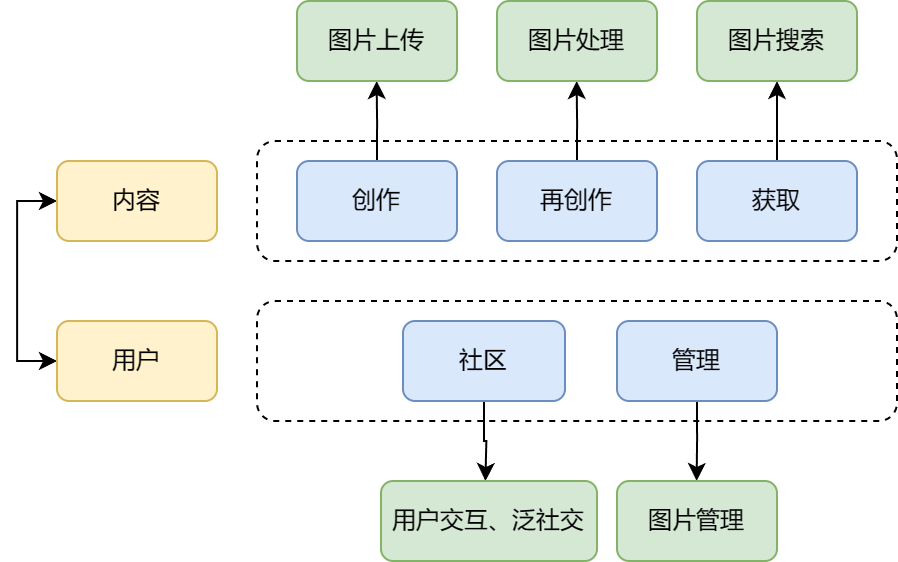

# 前端

## 架构设计

## 功能设计

### 导航栏

- Logo 和主页按钮，可从任意页面跳转至主页。
- 未登录状态下：登录按钮，可跳转至登录/注册页面。
- 登录状态下：用户头像按钮，提供多项常用操作的悬浮菜单，并跳转至相应页面，包括【上传图片】、【查看图片任务】、【进入个人主页】、【私信】、【用户登出】等功能。

### 主页

- 图片轮播走马灯，可展示精选的优质图片。
- 搜索框，可针对图片标题、上传者、分类、标签分别搜索。
- 图片个性推荐列表，可根据登录用户的浏览、搜索等行为个性化推荐图片。
- 仪表板，包括【创作中心】、【社区】、【关于我们】三个模块，提供作品数、关注数、粉丝数的数据展示，以及【上传图片】、【管理作品】、【私信】、【分享】等功能的跳转按钮。

### 搜索

- 搜索对象选择框，可针对图片标题、上传者、分类、标签分别搜索。
- 搜索框，在空状态下可显示搜索历史和搜索热词，在用户输入后可根据输入的内容给出搜索推荐。
- 搜索模式选择框，可选择搜索采用的匹配模式，包括精确、部分、模糊、关联、正则。
- 筛选器，可根据图片的高度、宽度、时长、分类、标签对搜索结果进行筛选。
- 搜索结果采用瀑布流式加载，图片支持先低分辨率、后高分辨率加载。
- 搜索结果图片支持批量下载和批量分享。

### 图片

- 图片展示卡片，显示图片内容、标题、分类、标签、尺寸、时长等信息，其中标签和分类可点击跳转至相应的图片搜索结果页。
- 上传者展示卡片，显示上传者用户名和头像，实现了上传者主页的跳转按钮，关注按钮。
- 图片点赞、下载、分享按钮。
- 图片管理卡片，用户可对自己的上传图片进行【修改分类和标签】、【添加水印】、【删除】操作。
- 图片评论区，支持发表评论、删除评论、点赞评论、楼中楼等功能。
- 上传图片，支持普通上传、压缩上传、上传视频转 GIF。
- 图片任务处理列表，【添加水印】、【压缩上传】、【视频转码】三种操作采用非阻塞式设计，用户执行操作将会提交任务至后台执行。用户可通过定时更新的任务列表查看任务的处理进度。

### 用户

- 友好的注册/登录页面。
- 用户名、头像、邮箱、个性签名、注册时间的展示，关注按钮和私信按钮。
- 全部上传图片的展示，支持对上传作品进行批量删除操作。
- 浏览历史，采用瀑布流式加载。
- 关注、粉丝列表，采用瀑布流式加载。
- 友好的个人信息修改页面，支持修改头像、个性签名、密码。

### 私信和通知

- 支持创建会话和发送消息，支持历史消息的瀑布流式加载。
- 新消息支持通过 Web Notifications 进行系统通知。
- 关注的作者上传新图片后推送通知。

## 实现

### `utils/`

- `contexts.ts`

    提供用户登录信息、用户头像信息的上下文管理。

    **使用 `creatContext` 定义了如下变量：**

    |       变量名        |        类型         |        功能        |
    | :-----------------: | :-----------------: | :----------------: |
    |  `UserInfoContext`  |  `UserInfoHandler`  | 用户登录状态的管理 |
    | `UserAvatarContext` | `UserAvatarHandler` | 用户头像信息的管理 |

- `Network.ts`

    网络请求配置和相关的功能函数。

    **变量：**

    |  变量名   |      类型       |       功能       |
    | :-------: | :-------------: | :--------------: |
    | `service` | `AxiosInstance` | 全局网络请求配置 |

    **函数：**

    |  函数名   |     返回     |       功能       |
    | :-------: | :----------: | :--------------: |
    | `request` | `Promise<T>` | 生成通用网络请求 |

    |  参数名   |       类型        |     意义     |
    | :-------: | :---------------: | :----------: |
    |   `url`   |     `string`      |   请求 URL   |
    | `method`  |    HTTP method    |   请求方法   |
    | `handler` | `UserInfoHandler` | 用户登录信息 |
    |  `data`   |       `any`       |    请求体    |
    | `options` |       `any`       | 请求附加选项 |

- `request.ts`

    前端用到的所有网络请求的进一步封装。

### `pages/`

- _app.tsx`

    Next.js 的 App 组件，用于跨页面的用户登录状态管理以及页面切换时保持布局的持久化。

    **`Context.Provider` 组件：**

    |            组件名            |          功能          |
    | :--------------------------: | :--------------------: |
    |  `UserInfoContext.Provider`  | 提供用户登录状态上下文 |
    | `UserAvatarContext.Provider` | 提供用户头像信息上下文 |

- `_document.tsx`

    自定义的 Next.js Document，定义了网页标题、图标、加载动画等。

- `index.tsx`

    主页。

- `login.tsx`

    用户登录页面。

- `search.tsx`

    搜索结果页面。

- `task.tsx`

    图片处理任务管理页面。

- `image/`

    - `[id].tsx`：图片详情页面，动态路由`[id]`对应图片 ID。
    - `upload.tsx`：图片上传页面。

- `user/[id]/`

    动态路由`[id]`对应用户 ID。

    - `index.tsx`：用户主页。

    - `[tab].tsx`：

        |   `tab`    |                 页面                  |
        | :--------: | :-----------------------------------: |
        |   未提供   | 路由至 `user/index.tsx`，对应用户主页 |
        |  `works`   |             用户作品页面              |
        | `history`  |             浏览历史页面              |
        | `settings` |           用户信息修改页面            |

- `signup/`

    - `index.tsx` ：用户注册页面。
    - `success.tsx`：注册成功页面，提示用户检查激活邮件。
    - `verify.tsx`：邮箱验证成功页面。

- `message/`

    - `index.tsx`：消息中心主页，显示会话列表和空的聊天窗口。
    - `[id].tsx`：私信页面，动态路由 `[id]` 对应聊天对象的用户 ID。

### `components/`

- `carousel.tsx`

    图片轮播走马灯组件。

- `comlist.tsx`

    评论区组件。

- `dyntag.tsx`

    支持动态增删的标签组件。

- `footer.tsx`

    全局页脚组件。

- `header.tsx`

    全局页眉导航栏组件。

- `image.tsx`

    - `ImageMetadataCard` ：图片信息展示卡片。
    - `ImageContentCard` ：图片内容卡片，包含分类、标题、标签的展示和点赞、下载、分享的功能按钮。
    - `ImagePreviewCard`：图片预览卡片。
    - `ImagePreviewListInner`：图片预览卡片组成的列表，用于主页、用户页、搜索结果页的多图展示。

- `layout.tsx`

    全局排版组件。

- `likes.tsx`

    点赞功能组件。

- `logo.tsx`

    Logo 展示组件。

- `message.tsx`

    私信消息组件。

- `notfound.tsx`

    not found 页面的显示组件。

- `notification.tsx`

    web notification 权限设置和通知组件。

- `search.tsx`

    - `CategorySelect` ：图片分类选择组件。
    - `SearchBox`：通用的搜索框组件。
    - `SearchFilter`：搜索筛选器组件。

- `sider.tsx`

    侧边栏组件。

- `user.tsx`

    - `UserAvatar`、`UserAvatarCard`、`UserAvatarBanner` ：用户头像及相关信息的展示组件。
    - `UserProfileCard` ：用户信息展示卡片。
    - `UserFollowList`、`UserFollowCard`：用户粉丝、关注列表组件。
    - `UserWorkdsCarousel`：用户作品轮播走马灯组件。
    - `UserWorksCard`：用户作品展示列表。
    - `UserHistoryCard`：浏览历史展示列表。
    - `UserProfileSettingCard`：用户头像、个性签名修改卡片。
    - `UserPasswordSettingCard`：用户密码修改卡片。
