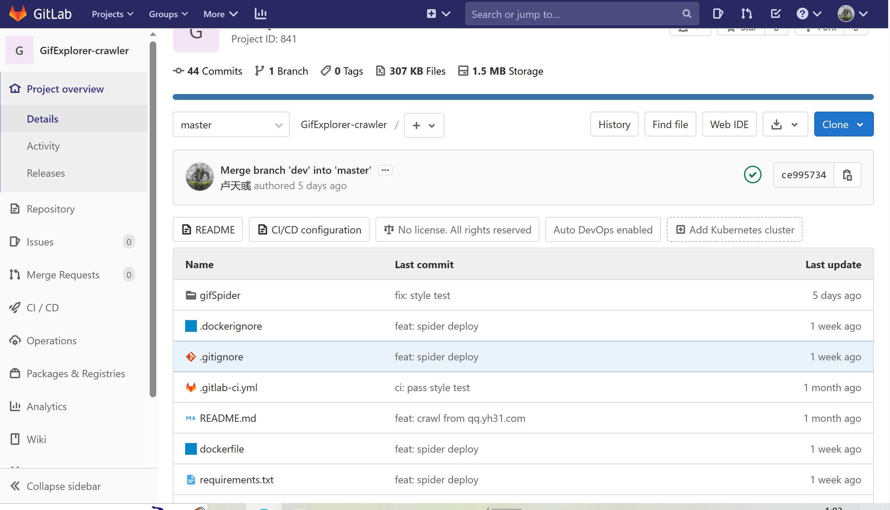
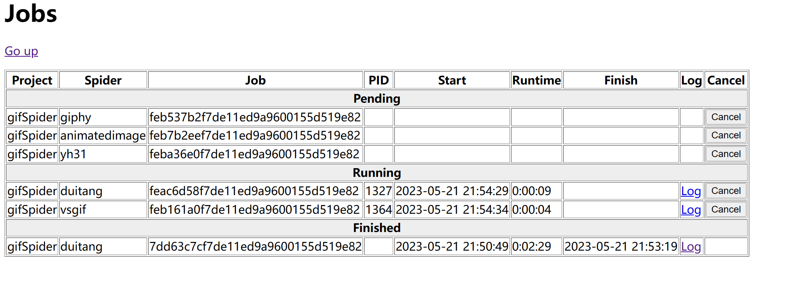

# 爬虫

## 技术选型

- Scrapy 框架 `version==2.8.0` ，是一款成熟的爬虫框架

## 功能设计

- **多来源大规模**，支持从以下多个高质量图源分类获取 Gif，能够爬取 1w 以上的页面，构建 10w 量级的图库，在保证图库的规模的同时精选图片，切合用户审美

  - `www.giphy.com`

    

  - `www.vsgif.com`

    
  
  - `www.duitang.com`

    

  - `www.yh31.com`

    

  - `www.animatedimages.org`

    

- **异步框架快速爬取**，`Scrapy` 使用 `Twisted` 异步网络框架来处理网络通信，加快下载速度

- **高拓展性**，`Scrapy` 内的 `Middle Ware` 允许用户根据需求自定义处理模块，引入拓展功能，即插即用

- **反爬措施**，通过在 `setting` 中限制下载速度，减少并发 `request` 数目，使用随机 `user-agent` 等设置处理避开反爬措施，同时仍然严格遵守 `robots.txt` 等爬虫规范

- **轻量级**，对于动态页面，没有选择使用 `selenium` 等工具真实地模拟出一个浏览器来进行访问，动态页面的爬取都是通过抓包分析找到真正的图源实现的，无论是在本机还是服务器上运行，都非常轻便

- **自动化**，在 `gitlab` 上持续集成，通过 `scrapyd` 在本地部署，提供脚本实现爬虫的定时启动，以对数据库进行更新，同时由于本地 `http cache` 的存在，重复页面爬取速度非常快，定时重启不会带来过大压力

## 实现

### `pipeline`

- 实现图片下载功能，根据获取的图片元信息，从源网页获取 Gif 的二进制数据，在本地下载缓存，然后与元信息组装后，通过后端接口上传（在后端的实现中会同时上传至 Postgres 和 ElasticSearch 数据库），如果爬取的网页中元信息不完整，此时还会进行自动标注
- 本地部署的爬虫连接本地后端，不会将图传至 `secoder`

### `item`

- 虽然给每个 `spider` 分配了一个对应的 `item` 类，但结构都是相同的，包含 `title`、`url`、`tag`、`category` 其中 `tag` 为字符数组，其余为字符类型，通过多网页分层级爬取构造出 `item`，将其交给 `pipeline` 进行下载处理

### `spider`

- `giphy_spider`

    通过抓包分析发现，可以在 `https://api.giphy.com/v1/gifs/search` 下携带参数`api_key=Gc7131jiJuvI7IdN0HZ1D7nh0ow5BU6g`

    进行搜索，通过 `q` 搜索参数和 `offset` 翻页参数可以获取某一类别下的全部 Gif

    可以在 `gifexplorer-crawler/gifSpider` 目录下执行 `scrapy giphy` 启动

- `vsgif_spider`

    类似 Giphy 可以在 `https://vsgif.com/search/getgoodsajax` 下指定参数 `path=search` 携带 `q` 搜索参数和 `page` 翻页参数爬取全部内容

    可以在 `gifexplorer-crawler/gifSpider` 目录下执行 `scrapy vsgif` 启动

- `duitang_spider`

    这是一个高质量图库，内含丰富的精美 Gif ，但数量相对较少，因此直接将 `url` 和分类 `category` 进行对应，分类爬取全部图片，根据抓包发现将 `url` 中的 `dtstatic` 替换为 `duitang` 即能访问到真正的图片，完成爬取。

    可以在 `gifexplorer-crawler/gifSpider` 目录下执行 `scrapy duitang` 启动

- `yh31_spider`

    用于扩充图片来源，选择了一个较小的中文 Gif 网站进行爬取，体量虽不如 giphy 和 vsgif 等知名网站，也能提供一些中文语境下的优秀梗图，爬取上比较简单，获取 `response` 后从中提取出下一页的 `url`，递归地爬取即可

    可以在 `gifexplorer-crawler/gifSpider` 目录下执行 `scrapy yh31` 启动

- `animatedimage_spider`

    提供动画式的动图，相比前几个来源这些 Gif 更轻量，爬取时根据首页推荐分类，跳转到各页进行爬取，再添加翻页参数翻页即可

    可以在 `gifexplorer-crawler/gifSpider` 目录下执行 `scrapy animatedimage` 启动

### CI

### 部署

- 通过 `scrapyd` 对爬虫任务进行管理，需要在本地开启 `scrapyd` 服务，随后启动定时脚本即可发布爬虫任务，并在规定时间（一周后）取消

- 执行 `scrapyd` 管理爬虫任务，可在 `http://localhost:6800` 中查看，如果没有发现 `gifSpider project` 则需要在 `gifexplorer-crawler/gifSpider` 目录下执行 `scrapyd-deploy gifexplorer -p gifSpider` 将爬虫项目部署，以后可以就通过 `job` 管理爬虫任务，通过 `log` 查看爬取状态信息等

    
