# 需求分析

## 概述

支持用户信息管理

- 修改密码，头像，个性签名
- 查看 Gif 浏览历史
- 查看 Gif 上传历史

支持用户多元化社交

- 提供个性推荐 Gif
- Gif 详情页支持点赞、评论
- 提供创作者关注功能
- 提供用户私信界面，创作者上传 Gif 后实时私信通知

支持 Gif 图片管理

- 批量管理上传 Gif
- 支持 Gif 条件筛选
- 支持水印、压缩等扩展服务
- 支持外链单张、批量下载 Gif

提供 Gif 检索功能  

- 提供多种搜索模式
- 正确分词，提供用户输入纠错、预测等搜索词处理
- 检索结果按相关度依次排序
- 支持添加标题、作者、分类、标签等过滤条件
- 搜索响应高效，缓存使用合理
- 检索结果页用户美观易用

实现 Gif 及时更新

- 部署 Gif 爬虫及时更新 Gif 信息

## 用例分析

为更好地展示用户需求，可以从用户角度得到如下用例图：

